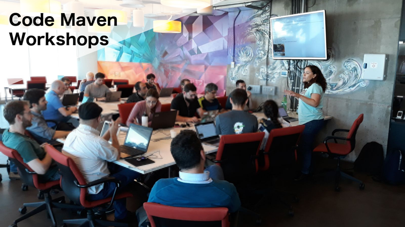

# Code-Maven Workshops

Lead by [Gabor Szabo](https://www.linkedin.com/in/szabgab/).

## Schedule of the public events that are usually free to participate in

* 2024.06.13 [Getting started with Docker for Perl developers](https://www.meetup.com/code-mavens/events/301268306/).
* 2024.06.16 [Web development in Rust using Rocket](https://www.meetup.com/code-mavens/events/301294669/).
* 2024.06.18 [Testing Python code](https://www.meetup.com/code-mavens/events/301363070/).
* 2024.06.20 [Functional programming in Python](https://www.meetup.com/code-mavens/events/301395323/).
* 2024.06.25 [Using the Liquid template system in Rust](https://www.meetup.com/code-mavens/events/301487547/)
* 2024.06.27 [Accepting parameters on the command line using Rust Clap](https://www.meetup.com/code-mavens/events/301506015/)
* 2024.07.14 [Continuous Integration (CI): GitHub Actions for Perl Projects](https://www.meetup.com/code-mavens/events/301413566/)

* Check out the [Meetup page](https://www.meetup.com/code-mavens/) or see the [earlier public events](history)

## Earlier workshops and video recordings

* 2024.06.06 [Your first contribution to an Open Source Rust project](https://www.meetup.com/code-mavens/events/301156302/) - [video](https://www.youtube.com/watch?v=Vf5-DRykoMIa)
* 2024.06.09 [GitHub pages for Rust developers](https://www.meetup.com/code-mavens/events/301215326/).

## Available Workshops

### Python

* [Mocking in Python as a testing tool](mocking-in-python-as-a-testing-tool)
* [Python Pair Programming with TDD](python-pair-programming-with-tdd)
* [Python testing workshop](python-testing)
* [Python pair programming - iteration vs recursion](python-iteration-vs-recursion)
* [Image manipulation with Python PIL - Pillow](image-manipulation-with-python-pil-pillow)
* [Fixtures and Test Doubles in Pytest (e.g. Mocking)](fixtures-and-test-doubles-in-python)

### Rust

* [Rust Maven Workshop: GitHub pages for Rust developers](github-pages-for-rust-developers)
* [Rust Maven Workshop: Your first contribution to an Open Source Rust project](your-first-contribution-to-an-open-source-rust-project)

### git

* [Git for beginners](git-for-beginners-part-1)
* [Git for beginners part 2](git-for-beginners-part-2)
* [Git advanced commands](git-advanced-commands)

### Docker

* [Getting started with Docker](getting-started-with-docker)

### GitHub

* [Setting up Continuous Integration for GitHub projects](setting-up-continuous-integration-for-github-projects)
* [Creating web presence with GitHub pages](creating-web-presence-with-github-pages)
* [GitHub Actions to generate complex static web sites](github-actions-to-generate-complex-static-web-sites)

### Linux

* [Linux as a virtual environment](linux-as-a-virtual-environment)
* [Opening the Linux Shell](opening-the-linux-shell)

### Other

* [XP: Pair Programming Workshop](xp-pair-programming-workshop-1)
* [Your First Open Source contribution](your-first-open-source-contribution)
* [Regular expressions for fun and profit](regexes-intro)
* [Getting Started with Digital Ocean](getting-started-with-digital-ocean)
* [How Open source projects are developed and how do they maintain quality?](open-source-quality-assurance)

## Host a workshop

Would you like to [host](host) a Code-Maven workshop?

## About the Code-Maven Workshops

Code Maven Workshops are short, 3-4-hours meetings with a mix or presentations and hands-on exercises to learn tools, technologies, and processes used in the world of Development,
Testing, Operations, and DevOps. They can be provided in-house at your company as a morning or afternoon half-day session.
Ocassionally they are also run via the [Code-Mavens at Meetup](https://www.meetup.com/Code-Mavens/)  group in which case they can usually be attended free of charge. Below you'll see the dates
and locations of the previous events.

## Courses

In addition to the 3-4-hours long workshops Gabor also provides full-length [training courses](https://hostlocal.com/) in these
subject. Check out the list of currently available courses and let me know if you are interested in either of those or
something in a related subject.

