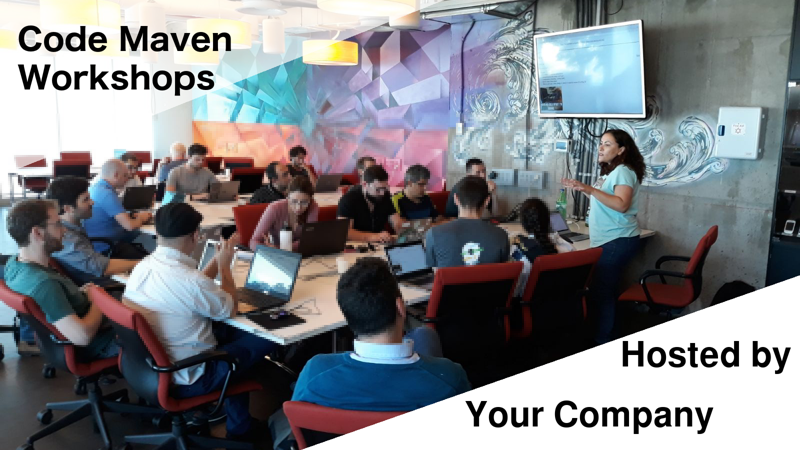

# Code-Maven Workshop hosts

## Why would you want to host a Code-Maven Meetup workshop?

* Brand awareness for your company among potential employees.
* Spreading the information about open positions in your company.
* Added value to your current employees who don't need to go elsewhere for this content.

## What we need

We organize workshops that include both presentations and hands on work by the participants. Therefore we need a place with a projector, tables, power slots near the tables, wifi access.

The number of attendees is usually between 20-60 so we need a space that can host that many people.

You need to provide refreshment for the attendees. Both drinks and food. How fancy you would like to make this it is up
to you, but it should be something to make the attendees feel welcome.  Budget 20-50 NIS / person.

When selecting food, please take in account that there will be people who prefer kosher food and others who might want to have lighter meals. Eg. Fruits, vegetables
besides the pizzas, sandwiches, cookies etc.

It is recommended to provide the drinks as people arrive.
If you provide cold food it is a good idea to have it available when people arrive.
If you decide to order something hot, eg. Pizza, then it is better to have it in a break so it arrives when everybody
has already arrived.

In our previous workshops the number of registrations were between 50-180.  Our experience shows that about 20 -50% of the registered people show up.
The actual number of attendees (the people who arrived) was between 20-60. The unfortunate nature of meetups is that you don't know how many people will come.

## What you get

In the meetup announcement we'll include your name and a short description of what you do, something that should make it interesting to developers.
We can even adjust the image on the given Meetup event to include the name of your company as the host of the event.
(see example on this page.)
The image needs to be at least 1200 x 675 pixels is picked up by the various social networks (e.g. LinkedIn, Twitter, Facebook) where we announce the workshop.

In our communications we'll include the name of your company where possible.

These will reach a few thousand developers. (The [Code-Mavens](https://www.meetup.com/Code-Mavens) Meetup group has over
1,200 members and the event announcement reaches a much wider audience of Meetup user.

Before or during the workshop you'll have the opportunity to give a 5 min presentation about the company.

We usually have some ice-breaking session to help people know each other more. We can work with you to figure out something that has some extra connection to your company.

Check out the [main page](/) for some ideas for content and [contact Gabor](https://szabgab.com/contact.html) to discuss the possibilities.

