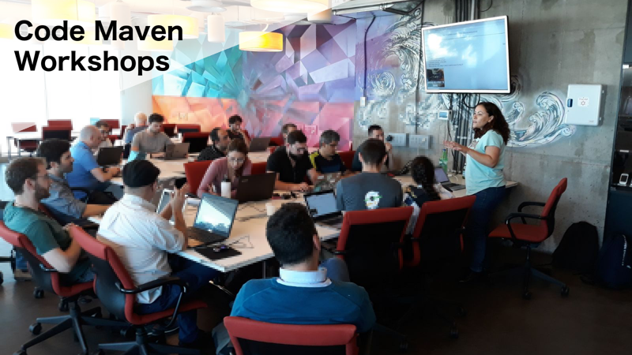

# Code-Maven Workshops in Israel

Lead by and [Gabor Szabo](https://www.linkedin.com/in/szabgab/).

Some of workshops were also lead by [Yonit Gruber-Hazani](https://www.linkedin.com/in/yonitgruber/)

## Schedule

* [Fixtures and Test Doubles in Pytest (e.g. Mocking)](fixtures-and-test-doubles-in-python)

## Ideas

These are just ideas. They might change. They might get abandoned. You are more that welcome to comment on them
suggest new ones via the [GitHub repository](https://github.com/szabgab/workshops/) of this page or in
a private e-mail to gabor at szabgab.com.

* [Getting Started with Digital Ocean](getting-started-with-digital-ocean)
* [Creating Jenkins pipeline without any coding](creating-jenkins-pipelines-without-any-coding)
* [Jenkins pipeline exclusively with Groovy code](jenkins-pipeline-with-groovy-code)
* [Creating web presence with GitHub pages](creating-web-presence-with-github-pages)
* [Image manipulation with Python PIL and Pillow](image-manipulation-with-python-pil-pillow)
* ... More to come.

## Follow us at:

* [Meetup](https://www.meetup.com/Code-Mavens/)

## About the Code-Maven Workshops

Code Maven Workshops are short meetings with a mix or presentations and hands-on exercises to learn tools, technologies, and processes used in the world of Development,
Testing, Operations, and DevOps worlds.

The workshops will cover subjects such as

* Linux CLI
* Version control (Git)
* Testing (Unit, Integration, Acceptance)
* Logging and monitoring (StatsD, ElasticSearch)
* Configuration management (Ansible, Chef, Puppet)
* Virtualization (Vagrant, Docker, Kubernetes)
* Continuous Integration ( Travis-CI, Jenkins, CircleCI, Appveyor )
* Continuous Delivery
* Continuous Deployment
* Cloud infrastructure (Amazon AWS, Google Cloud Platform, Microsoft Azure)
* Microservices Architecture
* Serverless Architecture

Just to name a few.

## Earlier events

* 2018.08.02 [Setting up Continuous Integration for GitHub projects](setting-up-continuous-integration-for-github-projects) in [Microsoft StartHub](http://starthub.co.il/) in Tel Aviv
* 2018.07.18 18:30-21:30 [How to develop software faster and have more stable releases?](https://www.meetup.com/Code-Mavens/events/252083358/) in [40nuggets](https://40nuggets.com/) in Jerusalem
* 2018.07.05 18:00-22:00 [XP: Pair Programming Workshop](https://www.meetup.com/Code-Mavens/events/249863089/) in [Google Campus](https://www.campus.co/tel-aviv/en) in Tel Aviv
* 2018.06.25 16:00-19:00 [Serverless AWS Lambda](https://www.meetup.com/Code-Mavens/events/246910872/) in [Cellebrite](https://www.cellebrite.com/) in Petach Tikva
* 2018.05.31 16:00-18:00 [How to develop software faster and have more stable releases?](https://www.meetup.com/Code-Mavens/events/251148675/) in [WeWork HaZerem](https://www.wework.com/buildings/10-hazerem-st--tel-aviv) in Tel Aviv
* 2018.05.29 16:00-19:00 [Continuous Integration with Jenkins](https://www.meetup.com/Code-Mavens/events/246910783/) in [Google Campus](https://www.campus.co/tel-aviv/en) in Tel Aviv
* 2018.05.23 18:00-19:00 [Mocking in Python as a testing tool - Workshop](https://www.meetup.com/PyWeb-IL/events/246802670/) [slides](https://code-maven.com/slides/python-mocking/) in [Google Campus](https://www.campus.co/tel-aviv/en) in Tel Aviv
* 2018.04.30 15:00-17:30 [Git for beginners part 2](https://www.meetup.com/Code-Mavens/events/249897829/) in [Google Campus](https://www.campus.co/tel-aviv/en) in Tel Aviv
* 2018.04.16 16:00-18:00 [Git for beginners](https://www.meetup.com/Code-Mavens/events/246910733/) in [Google Campus](https://www.campus.co/tel-aviv/en) in Tel Aviv
* 2018.03.21 16:00-18:30 [Introduction to Ansible](https://www.meetup.com/Code-Mavens/events/246910297/) - [slides](https://code-maven.com/ws2) in [Google Campus](https://www.campus.co/tel-aviv/en) in Tel Aviv
* 2018.02.27 15:30-18:00 Getting started with Linux inside Windows - [Linux as a virtual environment](https://www.meetup.com/Code-Mavens/events/246815054/) - [slides](https://code-maven.com/ws1) - [exercises](https://code-maven.com/exercise-linux-as-a-virtual-environment-nginx) in [Google Campus](https://www.campus.co/tel-aviv/en) in Tel Aviv
* 2018.02.28 18:00-22:00 [Mob programming](https://www.meetup.com/Code-Mavens/events/246827710/) in [Yuda](https://modiinapp.com/en/page/4875/yuda-center-for-young-adults) in Modiin
* 2018.01.24 18:00-22:00 [Your First Open Source contribution](https://www.meetup.com/Code-Mavens/events/246683264/) in [Google Campus](https://www.campus.co/tel-aviv/en) in Tel Aviv
* 2018.01.16 18:00-22:00 [Python Pair Programming with TDD Workshop](https://www.meetup.com/PyWeb-IL/events/246150120/) in [Google Campus](https://www.campus.co/tel-aviv/en) in Tel Aviv
* 2017.12.19 18:00-22:00 [Python testing workshop](https://www.meetup.com/PyWeb-IL/events/245433267/) [slides](https://code-maven.com/slides/python-programming/testing-with-pytest) in [Google Campus](https://www.campus.co/tel-aviv/en) in Tel Aviv

<link href="/workshops.css" rel="stylesheet">

