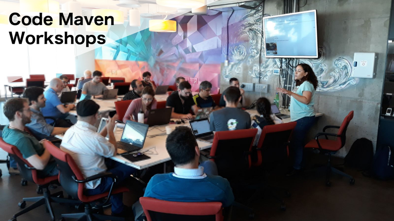

# Code-Maven Workshops in Israel

Lead by [Gabor Szabo](https://www.linkedin.com/in/szabgab/).

## Schedule of the public events that are usually free to participate in

* Check out the [Meetup page](https://www.meetup.com/code-mavens/) or see the [earlier public events](history)

## Available Workshops

* [How to develop software faster and have more stable releases?](how-to-develop-software-faster-and-have-more-stable-releases)
* [Getting started with Docker](getting-started-with-docker)
* [Getting Started with Google Cloud](getting-started-with-google-cloud)
* [Setting up Continuous Integration for GitHub projects](setting-up-continuous-integration-for-github-projects)
* [XP: Pair Programming Workshop](xp-pair-programming-workshop-1)
* [Serverless AWS Lambda](serverless-aws-lambda)
* [Continuous Integration with Jenkins](continuous-integration-with-jenkins)
* [Creating Jenkins pipeline without any coding](creating-jenkins-pipelines-without-any-coding)
* [Jenkins pipeline exclusively with Groovy code](jenkins-pipeline-with-groovy-code)
* [Git for beginners](git-for-beginners-part-1)
* [Git for beginners part 2](git-for-beginners-part-2)
* [Introduction to Ansible](introduction-to-ansible)
* [Linux as a virtual environment](linux-as-a-virtual-environment)
* [Mob programming](mob-programming)
* [Your First Open Source contribution](your-first-open-source-contribution)
* [Getting started with Golang](getting-started-with-golang)
* [Mocking in Python as a testing tool](mocking-in-python-as-a-testing-tool)
* [Fixtures and Test Doubles in Pytest (e.g. Mocking)](fixtures-and-test-doubles-in-python)
* [Python Pair Programming with TDD](python-pair-programming-with-tdd)
* [Python testing workshop](python-testing)
* [Python pair programming - iteration vs recursion](python-iteration-vs-recursion)
* [Getting started with Redis](getting-started-with-redis)
* [Opening the Linux Shell](opening-the-linux-shell)
* [Regular expressions for fun and profit](regexes-intro)
* [Git advanced commands](git-advanced-commands)
* [Getting Started with Digital Ocean](getting-started-with-digital-ocean)
* [Image manipulation with Python PIL - Pillow](image-manipulation-with-python-pil-pillow)
* [Infrastructure as Code with Terraform](terraform)
* [Creating web presence with GitHub pages](creating-web-presence-with-github-pages)
* [How Open source projects are developed and how do they maintain quality?](open-source-quality-assurance)

## Host a workshop

Would you like to [host](host) a Code-Maven workshop?

## About the Code-Maven Workshops

Code Maven Workshops are short, 3-4-hours meetings with a mix or presentations and hands-on exercises to learn tools, technologies, and processes used in the world of Development,
Testing, Operations, and DevOps. They can be provided in-house at your company as a morning or afternoon half-day session.
Ocassionally they are also run via the [Code-Mavens at Meetup](https://www.meetup.com/Code-Mavens/)  group in which case they can usually be attended free of charge. Below you'll see the dates
and locations of the previous events.

## Courses

In addition to the 3-4-hours long workshops Gabor also provides full-length [training courses](https://hostlocal.com/) in these
subject. Check out the list of currently available courses and let me know if you are interested in either of those or
something in a related subject.

## Further Workshops

These are just ideas. They might change. They might get abandoned. You are more than welcome to comment on them
or suggest new ones via the [GitHub repository](https://github.com/szabgab/workshops/) of this page or in
a private e-mail to gabor at szabgab.com.

* Getting Started with AWS
* [ELK - Elasticsearch - Logstash - Kibana stack](elk)
* Testing (Unit, Integration, Acceptance)
* Logging and monitoring (StatsD, ElasticSearch)
* Configuration management (Ansible, Chef, Puppet)
* Virtualization (Vagrant, Docker, Kubernetes)
* Continuous Integration ( Travis-CI, Jenkins, CircleCI, Appveyor )
* Continuous Delivery
* Continuous Deployment
* Cloud infrastructure (Amazon AWS, Google Cloud Platform, Microsoft Azure)
* Microservices Architecture
* Serverless Architecture

Just to name a few.

Some of workshops were also lead by [Yonit Gruber-Hazani](https://www.linkedin.com/in/yonitgruber/)

